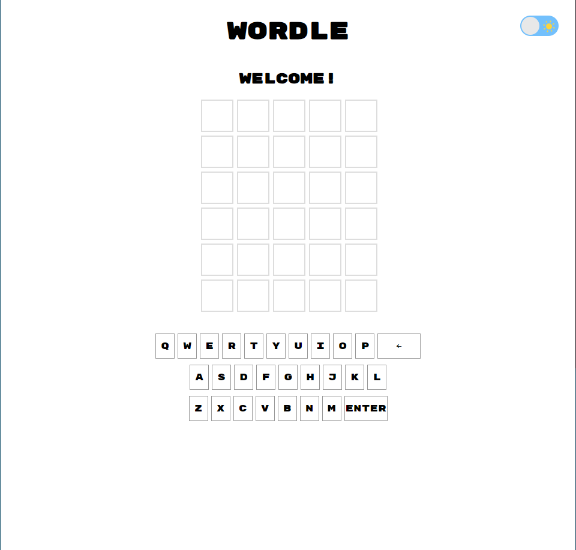

**WORDLE**

## Description

**Wordle** is a word guessing game that challenges players to guess a 5-letter word, given hints after each guess for a total of 6 attempts.  

### Background Information

The idea for this game originated from the popular NYT Games Wordle. The goal was to replicate the original with my own twists including audio and font. 

Why did I choose this game? I chose this game due to my love for the NYT Games Wordle. I have been playing the game close to everyday for about 3 years.

---

## Screenshot

  

*Here I have included a screenshot of the starting screen of the game*

---

## Getting Started

Here's how you can play and explore the game:

- **Play Online:** [Click here to play **WORDLE**](https://ian-ruiz21.github.io/Wordle/)

### Planning Materials

- Link to wireframe and pseudocode (https://github.com/ian-ruiz21/Wordle/tree/main/planning)

---

## Attributions

- Sound Effects - https://www.voicemod.net/
- Buttons - https://uiverse.io/
- WireFrame - https://www.canva.com/
- Favicon - https://www.favicon-generator.org/

---

## Technologies Used
- **Javascript**: For the games logic and interactivity.
- **HTML**: To structure the game's interface and layout.
- **CSS**: For styling the game and making it visually appealing.

## Next Steps
Here are some planned features for future versions of the game
1. **Mute Button**:
    - Add button that allows players to turn off sounds that play throughout the game.
2. **Streak Counter**:
    - Add a feature that allows players to see how many words they have guess correctly in a row.
3. **Score**: 
    - Give players a score based on how soon they guessed the word. Ex. First try = 1000 points, second try = 750 points.
4. **Keyboard Functionality**:
    - Allow players to use their keyboard instead of having to click on the screen.